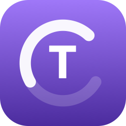

# Tokn



Track your Claude.ai session and weekly usage from the macOS menu bar — built from scratch so you know exactly what it does with your session key.

[](https://github.com/lumenworksco/Tokn/releases)
[](https://swift.org)
[](LICENSE)
[](https://github.com/lumenworksco/Tokn/releases/latest)

---

## Download

<div align="center">

<a href="https://github.com/lumenworksco/Tokn/releases/latest">
  
</a>

<br/>
<sub>macOS 14.0 Sonoma or later &nbsp;·&nbsp; Apple Silicon &amp; Intel &nbsp;·&nbsp; Free &amp; open source</sub>

</div>

<br/>

1. Download the `.dmg` from the [latest release](https://github.com/lumenworksco/Tokn/releases/latest)
2. Open it and drag **Tokn** into the **Applications** folder
3. Launch it — a coloured dot and percentage appear in your menu bar

> **First launch:** macOS will say "unidentified developer" since Tokn isn't notarized yet. Right-click **Tokn.app** → **Open** → **Open** to bypass it once.

---

## What it shows

- **Session (5h)** — usage within the current 5-hour rolling window, with exact time until reset
- **Weekly (7d)** — usage across the current 7-day window
- Colour-coded status: green (safe) → orange (≥50%) → red (≥80%)
- Menu bar dot updates colour in real time so you can tell at a glance without opening the popover
- **Burn rate ETA** — when you're on track to hit the limit before the window resets, the card footer shows both the reset time and "~2h at this pace" simultaneously; disappears automatically when usage slows or the window resets first (appears after a few minutes of use)
- **Usage history chart** — tap the sparkline on any card to expand a full history chart with dashed warning/critical threshold lines and a time-span label
- **Smart notifications** — configurable first threshold (50–90%) plus a fixed 100% alert; resets automatically when usage drops so future spikes notify again
- **Auto-updates** — checks for new versions on launch and installs them in one click

---

## Setup

1. Open [claude.ai](https://claude.ai) in Chrome or Safari
2. Open DevTools (`⌘⌥I`)
3. Go to **Application → Cookies → `claude.ai`**
4. Copy the value of the `sessionKey` cookie — it starts with `sk-ant-`
5. Click the Tokn icon in your menu bar and paste it in

Your session key is stored **only in the macOS Keychain** — never written to disk or sent anywhere other than `claude.ai`.

---

## Usage

| Action | How |
|--------|-----|
| Open popover | Click the Tokn dot/percentage in your menu bar |
| Refresh now | Click the **↻** button in the top-right of the popover |
| Expand history chart | Tap the sparkline on any card |
| Change refresh interval | **Settings** → Refresh |
| Change notification threshold | **Settings** → Notifications → threshold picker |
| Remove session key | **Settings** → Remove session key |
| Quit | **quit** in the popover footer |

---

## Building from source

Requires Xcode 16+ and macOS 14+.

```bash
git clone https://github.com/lumenworksco/Tokn.git
cd Tokn
open Tokn.xcodeproj
```

Hit **⌘R** in Xcode. No dependencies, no package manager.

Or from the command line:

```bash
xcodebuild -project Tokn.xcodeproj -scheme Tokn -configuration Release \
  CODE_SIGN_IDENTITY="" CODE_SIGNING_REQUIRED=NO
```

To regenerate the app icon at all sizes:

```bash
swift scripts/generate_icons.swift
```

---

## Architecture

| Layer | Files |
|---|---|
| Entry point | `Tokn/ToknApp.swift` |
| App state | `Tokn/App/AppModel.swift` |
| Models | `Tokn/Models/` |
| Keychain + Settings | `Tokn/Repositories/` |
| Network + Usage + Updates | `Tokn/Services/` |
| UI | `Tokn/Views/` |

Two API endpoints are used — `GET /api/organizations` (resolves your org UUID on first run) and `GET /api/organizations/{id}/usage` (fetches the usage data). All source is plain Swift with zero third-party dependencies, so the full behaviour is auditable in a few hundred lines.

---

## Contributing

Pull requests are welcome. For major changes please open an issue first to discuss the approach.

1. Fork the repo
2. Create a feature branch (`git checkout -b feature/my-feature`)
3. Commit your changes (`git commit -m 'Add my feature'`)
4. Push to the branch (`git push origin feature/my-feature`)
5. Open a Pull Request

---

## License

[MIT](LICENSE) © 2026 lumenworksco
